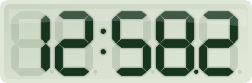
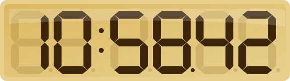
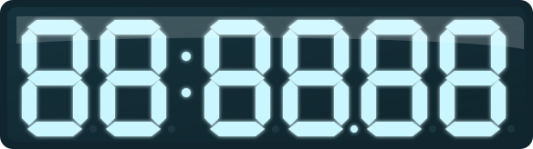
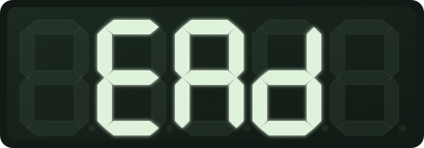

# seg-lcd-rust

[](https://github.com/Forjd/seg-lcd-rust/actions/workflows/ci.yml)
[](LICENSE)

A Rust simulator for seven-segment LCD displays like the digits used in basic
calculators, digital clocks, and classic digital watches.



## More Previews

| Amber clock | Blue glow | Negative display |
| --- | --- | --- |
|  |  |  |

It includes:

- a terminal renderer
- browser-viewable SVG and native PNG exporters
- a tiny HTTP API that returns rendered SVG
- a native `egui` desktop GUI
- WebAssembly bindings for browser demos
- a shared library for parsing text, segment masks, themes, geometry, terminal
  rendering, SVG rendering, and PNG rasterization

## Status

Early development. The CLI, SVG exporter, and native GUI are usable, but the API
is not yet stable.

## Usage

```bash
cargo run -- 0123456789
cargo run --bin seg-lcd-rust-gui
cargo run -- --labels HELP
cargo run -- --inverse 10:58.42
cargo run -- 12:34.5 --masks
cargo run -- --mask ABDEG --mask BCG --labels
cargo run -- --svg display.svg 0123456789
cargo run -- --svg amber.svg --theme amber 10:58.42
cargo run -- --svg blue.svg --theme blue --glow 88:88.88
cargo run -- --png blue.png --theme blue --glow 88:88.88
cargo run -- --svg custom.svg --on 102418 --off 6b7a62 --bg dbe5d2 --panel c3d0ba --inactive-opacity 0.18 1234
cargo run --bin seg-lcd-rust-api -- --addr 127.0.0.1:7878
```

`cargo run -- ...` runs the CLI by default. Use `cargo run --bin seg-lcd-rust-gui`
for the desktop app and `cargo run --bin seg-lcd-rust-api -- ...` for the HTTP
API.

CLI preview:

```text
$ cargo run -- 10:58.42
        ###       ###    ###           ###
    #  #   #  #  #      #   #  #   #      #
                  ###    ###    ###    ###
    #  #   #  #      #  #   #      #  #
        ###       ###    ### #         ###
```

## Install

Install the latest Linux or macOS release binaries with:

```bash
curl -fsSL https://raw.githubusercontent.com/Forjd/seg-lcd-rust/main/install.sh | sh
```

By default this installs both binaries to `~/.local/bin`:

- `seg-lcd-rust`
- `seg-lcd-rust-gui`

Install to a custom directory:

```bash
curl -fsSL https://raw.githubusercontent.com/Forjd/seg-lcd-rust/main/install.sh | sh -s -- --dir /usr/local/bin
```

Install a specific release:

```bash
curl -fsSL https://raw.githubusercontent.com/Forjd/seg-lcd-rust/main/install.sh | sh -s -- --version v0.3.0
```

When a release includes `SHA256SUMS.txt`, the install script verifies the
downloaded archive before installing.

Windows binaries are available from GitHub Releases, but the install script is
currently for Linux and macOS only.

On macOS, the GUI binary is not signed or notarized yet, so Gatekeeper may ask
you to approve it before first launch.

Uninstall:

```bash
rm ~/.local/bin/seg-lcd-rust ~/.local/bin/seg-lcd-rust-gui
```

## GUI

Run the desktop GUI with:

```bash
cargo run --bin seg-lcd-rust-gui
```

The GUI provides a live LCD preview, editable display text, a custom segment
editor for toggling segments `A` through `G`, theme selection, color controls,
inactive-segment opacity, glow and glass toggles, and an SVG export button that
writes `gui-display.svg`.

## HTTP API

Run the basic SVG API with:

```bash
cargo run --bin seg-lcd-rust-api -- --addr 127.0.0.1:7878
```

Then request rendered SVG:

```bash
curl 'http://127.0.0.1:7878/svg?text=10%3A58.42&theme=amber'
curl 'http://127.0.0.1:7878/svg?mask=ABDEG&mask=BCG&theme=blue&glow=true'
```

`GET /svg` returns `image/svg+xml`. Query parameters match the SVG-focused CLI
options: `text`, `theme`, repeated `mask`, `on`, `off`, `bg`, `panel`,
`inactive-opacity`, `glow`, and `glass`. `GET /healthz` returns a plain health
check.

## WebAssembly

Build the Rust library as a browser-loadable Wasm package with:

```bash
cargo install wasm-pack
wasm-pack build --target web --out-dir web/pkg
```

Then serve the static demo from the project root:

```bash
python3 -m http.server 8080
```

Open <http://localhost:8080/web/>. The demo calls the Rust SVG renderer through
the Wasm exports in `src/wasm.rs`, so browser output stays aligned with the CLI
and GUI renderers. It also includes a custom segment editor with copyable
letter, binary, and hex masks.

## Library

The shared library can parse display text and render terminal or SVG output:

```rust
use seg_lcd_rust::{LcdStyle, TerminalStyle, render_svg, render_text};

let text = "12:34.5";
let terminal = render_text(text, TerminalStyle::default());
let svg = render_svg(text, LcdStyle::default());
```

## Structure

- `src/lib.rs` contains the shared segment model, parser, themes, terminal
  renderer, SVG renderer, and segment geometry.
- `src/wasm.rs` exposes browser-facing WebAssembly bindings for SVG rendering.
- `src/main.rs` is the CLI wrapper.
- `src/bin/api.rs` is the tiny HTTP SVG API.
- `src/bin/gui.rs` is the native `egui` desktop app.

## Checks

```bash
cargo fmt --check
cargo test
cargo clippy --all-targets -- -D warnings
```

## Build Binaries

Build optimized local binaries with:

```bash
cargo build --release --bins
```

The CLI binary is `target/release/seg-lcd-rust`. The GUI binary is
`target/release/seg-lcd-rust-gui`.

## Performance

On an Apple M4 Pro Mac running Rust 1.94.0, the release CLI completes typical
single-render invocations in about 1.3-1.5 ms when benchmarked without shell
startup overhead:

```bash
hyperfine --shell=none --warmup 50 --runs 200 \
  './target/release/seg-lcd-rust 0123456789' \
  './target/release/seg-lcd-rust 0123456789:0123456789.0123456789' \
  './target/release/seg-lcd-rust --svg /tmp/seg-lcd-rust-bench.svg --theme amber 10:58.42'
```

These short runs are mostly process-startup-bound; rendering longer display text
adds little overhead.

## Releases

Releases are automated with Release Please from Conventional Commits. Changes
merged to `main` update a release PR; merging that PR creates the GitHub Release,
updates `CHANGELOG.md`, and bumps the crate version. When Release Please creates
a release, the binary workflow builds and attaches CLI/GUI archives for Linux,
macOS, and Windows, plus `SHA256SUMS.txt`.

Pull requests should use a Conventional Commit title such as `feat: add segment
editor` or `fix(svg): preserve decimal points`.

### Publishing A Release

1. Merge feature and fix commits to `main` using Conventional Commit messages.
2. Wait for Release Please to open or update its release PR.
3. Review the generated version bump and `CHANGELOG.md` entries.
4. Merge the Release Please PR.
5. Confirm the release was created and the `Release Binaries` workflow passed.
6. Check the GitHub Release for platform archives and `SHA256SUMS.txt`.

The release archives are smoke-tested in CI before upload by unpacking each
archive, checking that both binaries are present, and running the CLI with
`--help` and sample display text.

## Options

- `--labels` renders segment names (`A` through `G`) instead of filled cells.
- `--inverse` renders active LCD segments as clear space against inactive blocks.
- `--masks` prints each character's seven-bit segment mask.
- `--mask <value>` renders a custom digit from segment letters such as `ABDEG`,
  comma-separated segment letters such as `A,B,D,E,G`, binary bits such as
  `0b1011011`, or hex bits such as `0x5b`. Repeat it to render multiple custom
  digits.
- `--svg <path>` writes a browser-viewable SVG rendering with faint inactive
  LCD segments.
- `--theme <name>` applies an SVG theme: `classic`, `green`, `amber`, `blue`,
  or `negative`.
- `--on <hex>`, `--off <hex>`, `--bg <hex>`, and `--panel <hex>` override SVG
  colors. Hex values can be written with or without `#`.
- `--inactive-opacity <number>` controls how visible inactive SVG segments are,
  from `0.0` to `1.0`.
- `--glow`, `--no-glow`, and `--no-glass` toggle SVG display effects.

Supported characters are digits, a small set of seven-segment-friendly letters,
space, `-`, `_`, `.`, and `:`.

## License

MIT. See [LICENSE](LICENSE).
